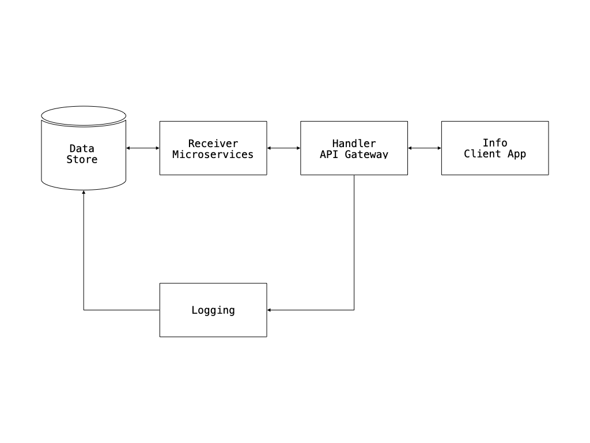
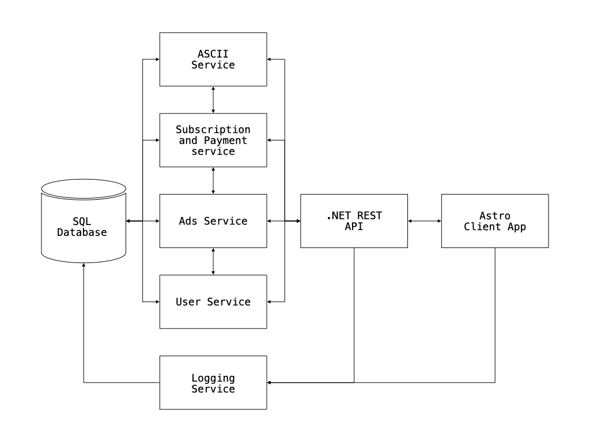
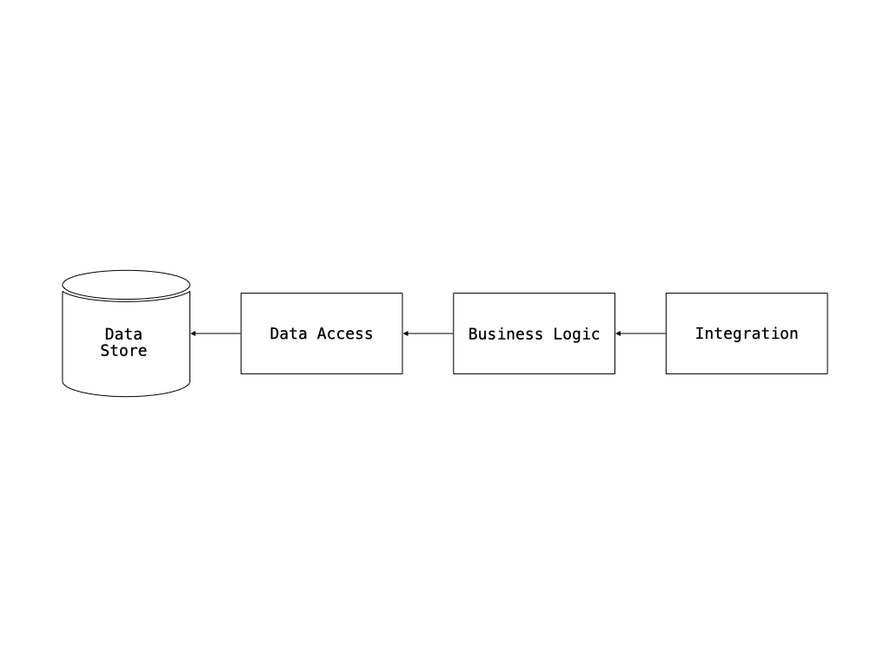
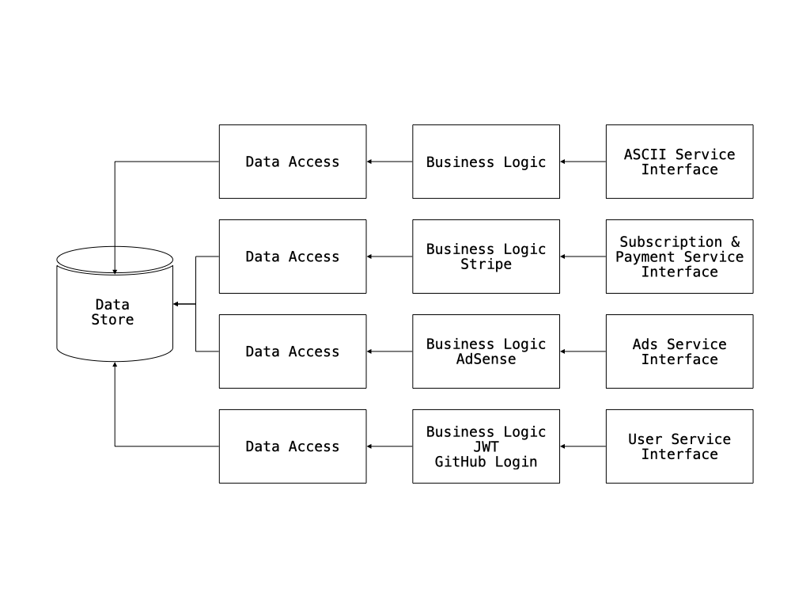
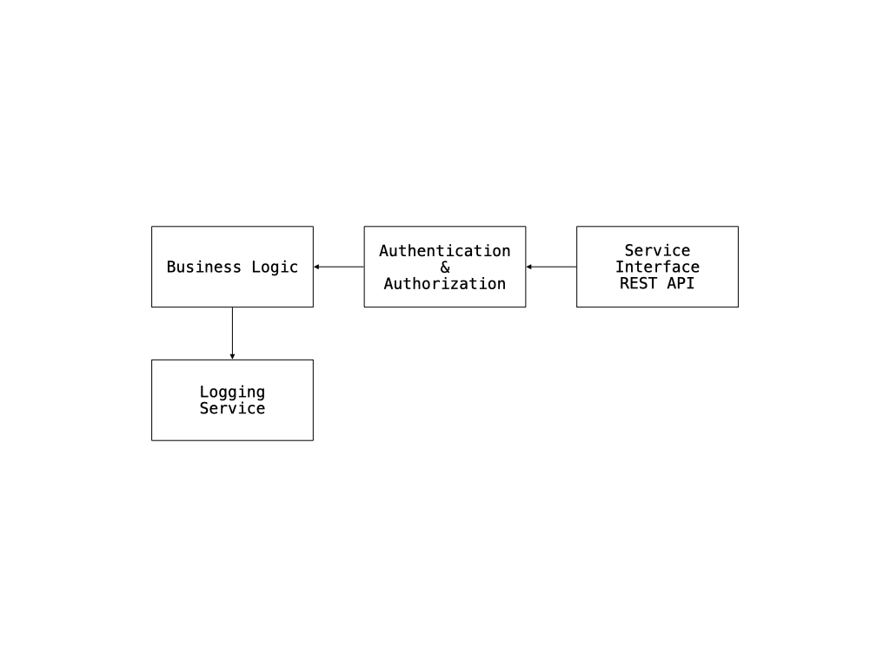
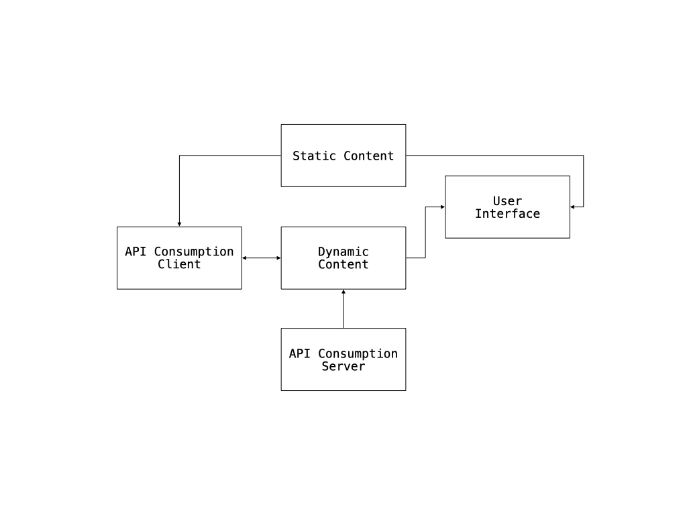

# Case Study

## ASCII Type Generator

### Architecture Document

**Written by:** Eduardo Aire Torres
**Date:** 2025-05-21

## Table of Contents

- [ASCII Type Generator](#ascii-type-generator)

  - [Background](#background)
  - [Requirements](#requirements)
    - [Functional Requirements](#functional-requirements)
    - [Non-Functional Requirements](#non-functional-requirements)
  - [Executive Summary](#executive-summary)
  - [Overall Architecture](#overall-architecture)
    - [Services](#overall-architecture-services)
    - [Scaling](#overall-architecture-scaling)
    - [Messaging](#overall-architecture-messaging)
  - [Services Drill Down](#services-drill-down)
    - [Logging](#logging)
      - [Role](#logging-role)
      - [Technology Stack](#logging-technology-stack)
      - [Architecture](#logging-architecture)
      - [Implementation Instructions](#logging-implementation)
    - [Receiver](#receiver)
      - [Role](#receiver-role)
      - [Technology Stack](#receiver-technology-stack)
      - [Architecture](#receiver-architecture)
      - [Implementation Instructions](#receiver-implementation)
    - [Handler](#handler)
      - [Role](#handler-role)
      - [Technology Stack](#handler-technology-stack)
      - [Architecture](#handler-architecture)
      - [Implementation Instructions](#handler-implementation)
    - [Info](#info)
      - [Role](#info-role)
      - [Technology Stack](#info-technology-stack)
      - [Architecture](#info-architecture)
      - [Implementation Instructions](#info-implementation)

<h2 id="background">Background</h2>

The ASCII Type Generator is an innovative web application that empowers users to create and share stunning ASCII art lettering and alphabets.

With a user-friendly and intuitive interface, the application ensures that users can effortlessly produce their ASCII art while easily browsing and searching through an extensive collection of creations made by others.

This platform serves a clear purpose: to unleash creativity and allow users to share their ASCII art with the world. It captures the nostalgia of the early days of the internet and emphasizes the distinct art of crafting typography in a bold, unconventional manner.

The application effectively stores all ASCII art created by users, enabling them to search, share, and manage their artworks through a powerful user dashboard.

Users initially have access to 3 artworks and 1 alphabet. However, by opting for a premium creator subscription, they can unlock unlimited possibilities, creating as many artworks and alphabets as they desire.

This document meticulously details the architecture of the application, highlighting the services used, the technology stack, and the comprehensive design of the system.

<h2 id="requirements">Requirements</h2>

<h3 id="functional-requirements">Functional Requirements</h3>

1. Enable users to register, log in, create, edit, and delete ASCII artworks, as well as upload and delete their own ASCII alphabets.
2. Store the artworks and alphabets in a database, and display them to other users with a search feature.
3. Implement a revenue model for the website that allows users to subscribe for unlimited uploads and incorporates advertisements on the site.

<h3 id="non-functional-requirements">Non-Functional Requirements</h3>

1. **Data Volume**: 1.9 GB annually
2. **Load**: Fewer than 100 concurrent requests
3. **Number of Users**: Fewer than 1,000 registered users
4. **Error Handling**: Data loss may occur, but users will be informed to try again (proper error handling is in place)
5. **Service Level Agreement (SLA) Level**: Platinum (fully stateless, easily scalable, logged, and monitored)

<h2 id="executive-summary">Executive Summary</h2>

The ASCII Type Generator is a web application that enables users to create and share ASCII art lettering and alphabets. Designed to be user-friendly and intuitive, this application allows users to easily craft their ASCII art and explore a vast collection of creations made by others.

The goal of the application is to provide a space where users can have fun, unleash their creativity, and share their ASCII art with the world.

The main focuses of the application are:

- **User Experience**: The application is designed to be intuitive and easy to use, allowing users to create ASCII art effortlessly and browse a wide range of creations made by others.
- **Creativity**: It encourages users to express their creativity and share their ASCII art simply by entering text for the artwork and uploading a TXT file for the alphabet.
- **Community**: The application fosters a community where users can share their ASCII art and explore an extensive collection of works from other users.
- **Affordability**: Designed to be low-cost, the application features a subscription model for unlimited uploads and includes advertisements to help cover operational expenses and support scalability.

To achieve these objectives, the application is built on a microservices architecture with a shared database to simplify scalability and maintenance. The technology stack includes SQLite for the database, .NET Core for the backend, Entity Framework for data access, and Astro with TypeScript and Tailwind CSS for the frontend, resulting in a lightweight and efficient application.

<h2 id="overall-architecture">Overall Architecture</h2>

This diagram illustrates the application's architecture. Although it is not fully microservices-based due to the shared database, it allows each service to be encapsulated, facilitating communication between them and access through the API gateway.

<h3 id="overall-architecture-services">Services</h3>

- **Receiver:** The receiver consists of microservices that will process user requests, validate the data, and store it in the database.

- **Handler:** The handler is the API gateway, responsible for routing user requests to the appropriate microservice and returning the responses to the users.

- **Info:** The info layer refers to the client application, which displays data to users and allows them to interact with the system.

- **Logging:** The logger is a microservice responsible for logging user requests in the database, including both successful requests and errors.

<h3 id="overall-architecture-scaling">Scaling</h3>

The application is designed to be easily scalable, allowing for the addition of more microservices as needed to manage increased load. The microservices are stateless, which makes them straightforward to replicate and distribute across multiple servers with load balancing.

The database is hosted with a cloud provider, facilitating easier scalability and minimizing the risk of data loss.

<h3 id="overall-architecture-messaging">Messaging</h3>

The application will use a message broker to handle the communication between the microservices. This will allow for asynchronous communication and decoupling of the services, making it easier to scale and maintain the application.

- **Receiver:** The receiver is the stack of services that will be responsible for processing the requests made by the users in an asynchronous, independent way. Only the API gateway can call the receiver, ant is the only way to process data from or to the database.
- **Handler:** The handler is the API gateway, it exposes all the API/HTTP endpoints to the users and routes the requests to the correct microservice. It will also handle authentication and authorization of the requests.
- **Info:** The info layer is the client application, it will consume the API exposed by the handler and will be responsible for displaying the data to the users and allowing them to interact with the system.
- **Logging:** The logging will be injected in the receiver, to log the requests made by the users to the database in the backend.

<h2 id="services-drill-down">Services Drill Down</h2>

<h3 id="logging">Logging</h3>

<h4 id="logging-role">Role</h4>

The logging service is responsible for recording all user requests, including successful operations and errors, in the database. This service is crucial for monitoring the application's performance and diagnosing issues.

<h4 id="logging-technology-stack">Technology Stack</h4>

The service will be developed using .NET Core and will utilize Entity Framework for data access. It will communicate with an SQLite database to manage records. Logging of requests will be handled in the handler, as it is a different technology from the info layer, and therefore, we will not inject it there.

<h4 id="logging-architecture">Architecture</h4>

The logging service will follow a classic layered architecture with three layers:

- **Data Access Layer:** Handles interactions with the database.
- **Business Logic Layer:** Processes and formats log data received from the application.
- **Service Interface:** Exposes methods for logging requests and errors, which can be called by the handler.

This structure allows the logging service to be easily injected and used internally by other components, rather than being accessed via external HTTP endpoints.

<h4 id="logging-implementation">Implementation Instructions</h4>

- Use dependency injection to inject the logging service into the handler.

<h3 id="receiver">Receiver</h3>

<h4 id="receiver-role">Role</h4>

The receiver will be developed using .NET Core, facilitating easy integration with the handler besides of providing great performance. It will utilize Entity Framework for data access and will process requests asynchronously. However, it won't use a message broker for communication, as the receiver will be called directly by the API gateway.

<h4 id="receiver-technology-stack">Technology Stack</h4>

The receiver will be developed using .NET Core, facilitating easy integration with the handler. It will utilize Entity Framework for data access and will process requests asynchronously.
Even though there is a logging service, each service in the receiver will retrieve the logs related to its operations, this will allow to maintain a clear separation of concerns, keeping the logging service focused on logging requests and errors, while each receiver service gets its own logs.
However, it won't use a message broker for communication, as the receiver will be called directly by the API gateway.

<h4 id="receiver-architecture">Architecture</h4>

The receiver architecture will be the following:

- **ASCII Service:** This will be a fully in-house service responsible for managing ASCII artworks.
- **Subscription & Payment Service:** We will utilize a third-party provider, such as Stripe, to manage payments and subscriptions.
- **Ads Service:** We will implement a third-party service, such as Google AdSense, to manage advertisements on the site and generate revenue.
- **User Service:** We will develop an in-house service to manage user accounts, including registration, login, and profile management. We will use JWT for authentication and authorization, and we will also offer GitHub login as an option.

<h4 id="receiver-implementation">Implementation Instructions</h4>

- Use dependency injection to inject the different services into the receiver's controllers.

<h3 id="handler">Handler</h3>

<h4 id="handler-role">Role</h4>

The handler is the API gateway that exposes all the API/HTTP endpoints to the users and routes the requests to the correct microservice. It will also handle authentication and authorization of the requests.

<h4 id="handler-technology-stack">Technology Stack</h4>

The handler will be developed using .NET Core, which provides a robust framework for building APIs. It will utilize Entity Framework for data access and will communicate with the receiver services to process requests.

<h4 id="handler-architecture">Architecture</h4>

The handler architecture will be the following:

The handler will consist of the following components:

- **REST API:** The handler will expose a REST API that will be consumed by the info layer.
- **Authentication & Authorization:** The handler will implement JWT for authentication and authorization, ensuring that only authenticated users can access the API endpoints.
- **Business Logic:** The handler will contain the business logic for processing requests and routing them to the appropriate receiver service, it will be connected to the logging service to log all requests and errors.
- **API Endpoints:** The handler will expose the following API endpoints:

  | Endpoint                                                   | Description                                                        | Methods                | Response Statuses       | Authenticated                 |
  | ---------------------------------------------------------- | ------------------------------------------------------------------ | ---------------------- | ----------------------- | ----------------------------- |
  | `/api/artworks?searchText={string}&skip={int}&take={int}`  | Search artworks by text with pagination; returns all if no params  | GET                    | 200, 400, 401, 500      | No                            |
  | `/api/artworks/{id}`                                       | Manage/view individual artwork (view, edit, delete)                | GET, POST, PUT, DELETE | 200, 400, 401, 404, 500 | GET: No, POST/PUT/DELETE: Yes |
  | `/api/artworks/user`                                       | Retrieve artworks created by the authenticated user                | GET                    | 200, 401, 404, 500      | Yes                           |
  | `/api/artworks/logs`                                       | Retrieve artwork logs for the authenticated user                   | GET                    | 200, 401, 404, 500      | Yes                           |
  | `/api/alphabets?searchText={string}&skip={int}&take={int}` | Search alphabets by text with pagination; returns all if no params | GET                    | 200, 400, 401, 500      | No                            |
  | `/api/alphabets/{id}`                                      | Manage/view individual alphabet (view, delete)                     | GET, DELETE            | 200, 400, 401, 404, 500 | GET: No, DELETE: Yes          |
  | `/api/alphabets/upload`                                    | Upload a new alphabet                                              | POST                   | 201, 400, 401, 500      | Yes                           |
  | `/api/alphabets/user`                                      | Retrieve alphabets uploaded by the authenticated user              | GET                    | 200, 401, 404, 500      | Yes                           |
  | `/api/alphabets/logs`                                      | Retrieve alphabet logs for the authenticated user                  | GET                    | 200, 401, 404, 500      | Yes                           |
  | `/api/users/register`                                      | User registration                                                  | POST                   | 201, 400, 409, 500      | No                            |
  | `/api/users/login`                                         | User login                                                         | POST                   | 200, 400, 401, 500      | No                            |
  | `/api/users/refresh`                                       | Refresh user authentication token                                  | POST                   | 200, 401, 500           | Yes                           |
  | `/api/users/logout`                                        | User logout                                                        | POST                   | 200, 401, 500           | Yes                           |
  | `/api/users/profile`                                       | Manage user profile (view, update, delete)                         | GET, PUT, DELETE       | 200, 400, 401, 404, 500 | Yes                           |
  | `/api/users/logs`                                          | Retrieve user logs for the authenticated user                      | GET                    | 200, 401, 404, 500      | Yes                           |
  | `/api/subscription/subscribe`                              | Subscribe to premium creator plan                                  | POST                   | 201, 400, 401, 402, 500 | Yes                           |
  | `/api/subscription/cancel`                                 | Cancel a subscription                                              | POST                   | 200, 400, 401, 404, 500 | Yes                           |
  | `/api/subscription/status`                                 | Check subscription status                                          | GET                    | 200, 401, 404, 500      | Yes                           |
  | `/api/subscription/logs`                                   | Retrieve subscription logs for the authenticated user              | GET                    | 200, 401, 404, 500      | Yes                           |
  | `/api/ads`                                                 | Retrieve advertisements to display                                 | GET                    | 200, 204, 400, 500      | No                            |
  | `/api/ads/click`                                           | Log an advertisement click                                         | POST                   | 200, 400, 401, 500      | No                            |
  | `/api/ads/logs`                                            | Retrieve advertisement logs for the authenticated user             | GET                    | 200, 401, 404, 500      | Yes                           |

<h4 id="handler-implementation">Implementation Instructions</h4>

- The REST API will be implemented using the repository pattern, with each endpoint corresponding to a specific controller, and it will use dependency injection to inject the receiver services.
- The logic should be minimal, basically just consuming the receiver services, handling the errors and returning the results to the user.
- The Authentication and Authorization will be a middleware that will be executed before the request reaches the controller, it will check if the user is authenticated and authorized to access the endpoint.

<h3 id="info">Info</h3>

<h4 id="info-role">Role</h4>

The info layer is the client application that consumes the API exposed by the handler. It will be responsible for displaying the data to the users and allowing them to interact with the system.

<h4 id="info-technology-stack">Technology Stack</h4>

The info layer will be developed using Astro with TypeScript and Tailwind CSS. This stack provides a straightforward way to build the site, making it easy to create a responsive and user-friendly interface with animations and transitions. Since Astro has a built-in architecture, we'll be using Astro islands to handle static and dynamic content efficiently both server-side and client-side.

<h4 id="info-architecture">Architecture</h4>

The info architecture will be the following:

The info layer will consist of the following components:

- **Static Content:** The static content will be served by the Astro framework, which will generate the HTML pages at build time.
- **Dynamic Content:** The dynamic content will be handled by the Astro islands, which will allow us to load the data from the API and render it on the client side.
- **API Consumption:** The info layer will consume the API exposed by the handler, using the Fetch API to make requests to the endpoints and display the data to the users.
- **User Interface:** The user interface will be built using Tailwind CSS, which will allow us to create a responsive and user-friendly interface with animations and transitions.

<h4 id="info-implementation">Implementation Instructions</h4>

- The info layer will be implemented using Astro with TypeScript and Tailwind CSS.
- If possible, we won't use any third-party libraries, as Astro provides a straightforward way to build the site.
