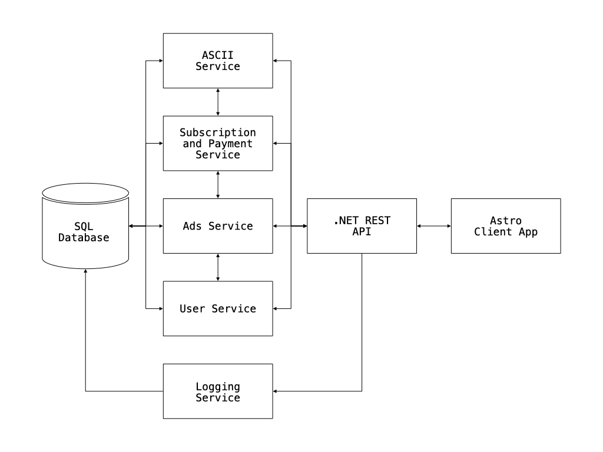
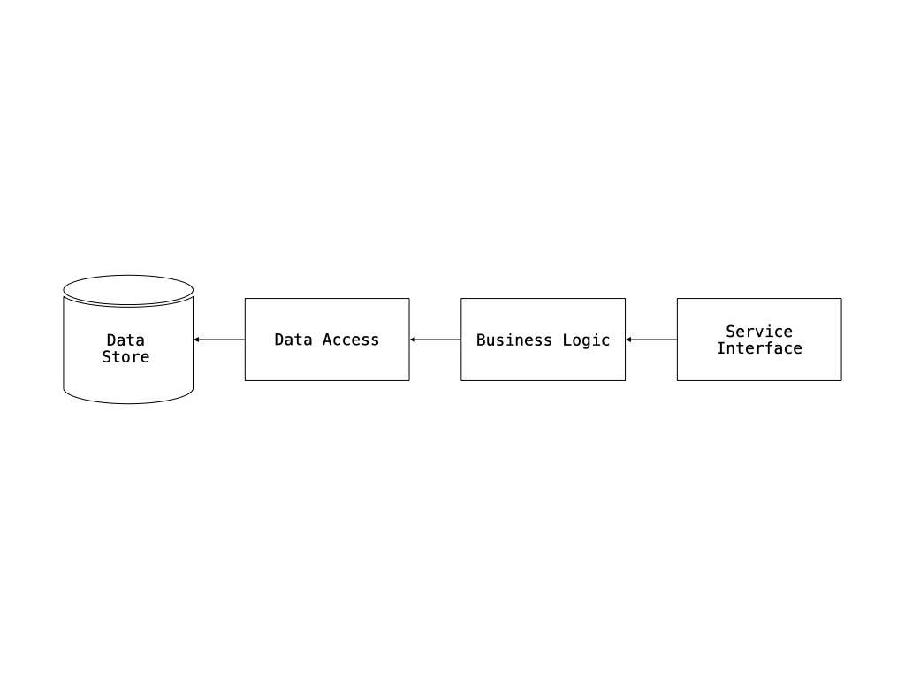

# Case Study

## ASCII Type Generator

### Architecture Document

**Written by:** Eduardo Aire Torres
**Date:** 2025-05-21

## Table of Contents

- [ASCII Type Generator](#ascii-type-generator)

  - [Background](#background)
  - [Requirements](#requirements)
    - [Functional Requirements](#functional-requirements)
    - [Non-Functional Requirements](#non-functional-requirements)
  - [Executive Summary](#executive-summary)
  - [Overall Architecture](#overall-architecture)
    - [Services](#overall-architecture-services)
    - [Scaling](#overall-architecture-scaling)
    - [Messaging](#overall-architecture-messaging)
  - [Services Drill Down](#services-drill-down)
    - [Logging](#logging)
      - [Role](#logging-role)
      - [Technology Stack](#logging-technology-stack)
      - [Architecture](#logging-architecture)
      - [Implementation Instructions](#logging-implementation)
    - [Receiver](#receiver)
      - [Role](#receiver-role)
      - [Technology Stack](#receiver-technology-stack)
      - [Architecture](#receiver-architecture)
      - [Implementation Instructions](#receiver-implementation)
    - [Handler](#handler)
      - [Role](#handler-role)
      - [Technology Stack](#handler-technology-stack)
      - [Architecture](#handler-architecture)
      - [Implementation Instructions](#handler-implementation)
    - [Info](#info)
      - [Role](#info-role)
      - [Technology Stack](#info-technology-stack)
      - [Architecture](#info-architecture)
      - [Implementation Instructions](#info-implementation)

<h2 id="background">Background</h2>

The ASCII Type Generator is an innovative web application that empowers users to create and share stunning ASCII art lettering and alphabets.

With a user-friendly and intuitive interface, the application ensures that users can effortlessly produce their ASCII art while easily browsing and searching through an extensive collection of creations made by others.

This platform serves a clear purpose: to unleash creativity and allow users to share their ASCII art with the world. It captures the nostalgia of the early days of the internet and emphasizes the distinct art of crafting typography in a bold, unconventional manner.

The application effectively stores all ASCII art created by users, enabling them to search, share, and manage their artworks through a powerful user dashboard.

Users initially have access to 3 artworks and 1 alphabet. However, by opting for a premium creator subscription, they can unlock unlimited possibilities, creating as many artworks and alphabets as they desire.

This document meticulously details the architecture of the application, highlighting the services used, the technology stack, and the comprehensive design of the system.

<h2 id="requirements">Requirements</h2>

<h3 id="functional-requirements">Functional Requirements</h3>

1. Enable users to register, log in, create, edit, and delete ASCII artworks, as well as upload and delete their own ASCII alphabets.
2. Store the artworks and alphabets in a database, and display them to other users with a search feature.
3. Implement a revenue model for the website that allows users to subscribe for unlimited uploads and incorporates advertisements on the site.

<h3 id="non-functional-requirements">Non-Functional Requirements</h3>

1. **Data Volume**: 1.9 GB annually
2. **Load**: Fewer than 100 concurrent requests
3. **Number of Users**: Fewer than 1,000 registered users
4. **Error Handling**: Data loss may occur, but users will be informed to try again (proper error handling is in place)
5. **Service Level Agreement (SLA) Level**: Platinum (fully stateless, easily scalable, logged, and monitored)

<h2 id="executive-summary">Executive Summary</h2>

The ASCII Type Generator is a web application that enables users to create and share ASCII art lettering and alphabets. Designed to be user-friendly and intuitive, this application allows users to easily craft their ASCII art and explore a vast collection of creations made by others.

The goal of the application is to provide a space where users can have fun, unleash their creativity, and share their ASCII art with the world.

The main focuses of the application are:

- **User Experience**: The application is designed to be intuitive and easy to use, allowing users to create ASCII art effortlessly and browse a wide range of creations made by others.
- **Creativity**: It encourages users to express their creativity and share their ASCII art simply by entering text for the artwork and uploading a TXT file for the alphabet.
- **Community**: The application fosters a community where users can share their ASCII art and explore an extensive collection of works from other users.
- **Affordability**: Designed to be low-cost, the application features a subscription model for unlimited uploads and includes advertisements to help cover operational expenses and support scalability.

To achieve these objectives, the application is built on a microservices architecture with a shared database to simplify scalability and maintenance. The technology stack includes SQLite for the database, .NET Core for the backend, Entity Framework for data access, and Astro with TypeScript and Tailwind CSS for the frontend, resulting in a lightweight and efficient application.

<h2 id="overall-architecture">Overall Architecture</h2>

This diagram illustrates the application's architecture. Although it is not fully microservices-based due to the shared database, it allows each service to be encapsulated, facilitating communication between them and access through the API gateway.

<h3 id="overall-architecture-services">Services</h3>

- **Receiver:** The receiver consists of microservices that will process user requests, validate the data, and store it in the database.

- **Handler:** The handler is the API gateway, responsible for routing user requests to the appropriate microservice and returning the responses to the users.

- **Info:** The info layer refers to the client application, which displays data to users and allows them to interact with the system.

- **Logging:** The logger is a microservice responsible for logging user requests in the database, including both successful requests and errors.

<h3 id="overall-architecture-scaling">Scaling</h3>

The application is designed to be easily scalable, allowing for the addition of more microservices as needed to manage increased load. The microservices are stateless, which makes them straightforward to replicate and distribute across multiple servers with load balancing.

The database is hosted with a cloud provider, facilitating easier scalability and minimizing the risk of data loss.

<h3 id="overall-architecture-messaging">Messaging</h3>

The application will use a message broker to handle the communication between the microservices. This will allow for asynchronous communication and decoupling of the services, making it easier to scale and maintain the application.

- **Receiver:** The receiver is the stack of services that will be responsible for processing the requests made by the users in an asynchronous, independent way. Only the API gateway can call the receiver, ant is the only way to process data from or to the database.
- **Handler:** The handler is the API gateway, it exposes all the API/HTTP endpoints to the users and routes the requests to the correct microservice. It will also handle authentication and authorization of the requests.
- **Info:** The info layer is the client application, it will consume the API exposed by the handler and will be responsible for displaying the data to the users and allowing them to interact with the system.
- **Logging:** The logging will be injected in the receiver, to log the requests made by the users to the database in the backend.

<h2 id="services-drill-down">Services Drill Down</h2>

<h3 id="logging">Logging</h3>

<h4 id="logging-role">Role</h4>

The logging service is responsible for recording all user requests, including successful operations and errors, in the database. This service is crucial for monitoring the application's performance and diagnosing issues.

<h4 id="logging-technology-stack">Technology Stack</h4>

The service will be developed using .NET Core and will utilize Entity Framework for data access. It will communicate with an SQLite database to manage records. Logging of requests will be handled in the receiver, as it is a different technology from the frontend, and therefore, we will not inject it there.

<h4 id="logging-architecture">Architecture</h4>

The logging service will follow a classic layered architecture with three layers:

- **Data Access Layer:** Handles interactions with the database.
- **Business Logic Layer:** Processes and formats log data received from the application.
- **Integration Layer:** Exposes logging functionality for injection into other services, enabling them to log events without exposing public API endpoints.

This structure allows the logging service to be easily injected and used internally by other components, rather than being accessed via external HTTP endpoints.

<h4 id="logging-implementation">Implementation Instructions</h4>

1. Use dependency injection to inject the logging service into the receiver.
2. Handle Database interactions using Entity Framework.
